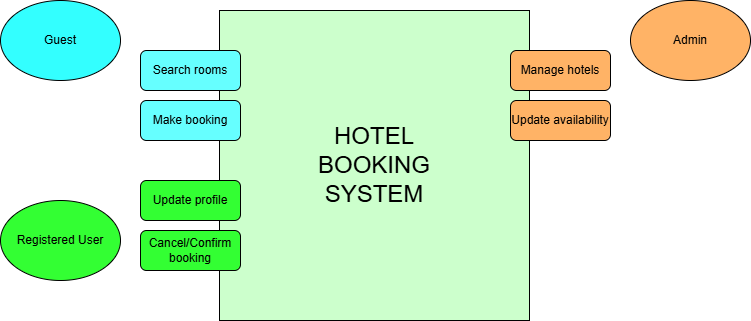

## What is Requirement Analysis?

Requirement Analysis is a crucial phase in the Software Development Lifecycle (SDLC). It involves gathering, understanding, and documenting the needs and expectations of users and stakeholders for a software project. This step ensures that developers and clients have a shared understanding of what the final system should do.

During Requirement Analysis, different types of requirements are identified, including functional requirements (what the system should do) and non-functional requirements (performance, security, usability, etc.). The process often includes interviews, surveys, workflow analysis, and review of existing documentation.

### Importance of Requirement Analysis

Requirement Analysis helps prevent misunderstandings that could lead to costly changes later in the development process. It allows the team to:

* Clearly define project goals and scope.
* Improve accuracy in planning and estimation.
* Ensure the system aligns with user needs.
* Reduce the risk of project failure.

In summary, Requirement Analysis lays the foundation for successful software development by ensuring that all stakeholders have a clear and agreed-upon vision of what the project should achieve.

## Why is Requirement Analysis Important?

Requirement Analysis is essential to ensuring a successful software development process. It plays a pivotal role in helping the team deliver a solution that truly meets stakeholder expectations. Here are some key reasons why it is so important:

1. **Prevents Miscommunication and Misunderstanding**
   Teams gain a clear and shared understanding of user needs, reducing the risk of incorrect assumptions and costly rework.

2. **Supports Accurate Planning and Estimation**
   With well-defined requirements, the project team can estimate time, cost, and resources more effectively, leading to improved project timeline and budgeting.

3. **Enhances Product Quality and User Satisfaction**
   Ensuring requirements align with user needs leads to a system that performs well and satisfies the users, increasing overall project success.

## Key Activities in Requirement Analysis

Requirement Analysis involves several important activities that help ensure a complete and accurate understanding of what the system should accomplish. These activities include:

* **Requirement Gathering**
  Collecting information from stakeholders such as users, managers, and clients to understand their needs and expectations.

* **Requirement Elicitation**
  Using techniques like interviews, workshops, questionnaires, and observation to uncover detailed and hidden requirements.

* **Requirement Documentation**
  Recording all gathered requirements in a structured format such as Software Requirements Specifications (SRS), ensuring clarity and traceability.

* **Requirement Analysis and Modeling**
  Studying and refining requirements to resolve conflicts, check feasibility, and represent them visually using models like diagrams or flowcharts.

* **Requirement Validation**
  Confirming that documented requirements accurately reflect stakeholder needs and are aligned with project goals before development begins.

## Types of Requirements

### Functional Requirements

Functional Requirements describe what the system must do to support its users and business operations. These are the core capabilities that enable users to perform actions within the application.

Examples for a **Hotel Booking Management System** based on the case study:

* Users must be able to search for hotels based on location, dates, and number of guests.
* The system must check room availability in real time.
* Users must be able to create and manage bookings including modification and cancellation.
* The system must support secure user registration and login.
* The platform must generate booking confirmations and send them via email or in-app notifications.
* Admin users must be able to add, update, or remove hotel listings and room details.

### Non-functional Requirements

Non-functional Requirements define how the system performs rather than what it does. These focus on quality attributes such as speed, security, usability, and scalability.

Examples for the **Hotel Booking Management System**:

* The system should handle a large number of concurrent user requests especially during peak travel seasons.
* Search results should be displayed within 2–3 seconds.
* The system must remain available 99.9% of the time to support global users.
* User data including payment information must be protected through strong encryption and secure transmission protocols.
* The application interface should be intuitive and responsive across web and mobile devices.
* The system should scale efficiently as the number of hotels and users increases.

## Use Case Diagrams

Use Case Diagrams visually represent the interactions between users (actors) and the system’s functionalities (use cases). This helps in understanding how different users will interact with the system and ensures that all required features are captured effectively.

### Benefits of Use Case Diagrams

* Provide a clear understanding of system functionality
* Help identify all user interactions early in the development process
* Serve as a communication tool between stakeholders and developers
* Assist in defining scope and project boundaries

### Hotel Booking System Use Case Diagram

The diagram below shows key actors and interactions for the hotel booking system:

